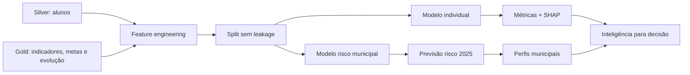
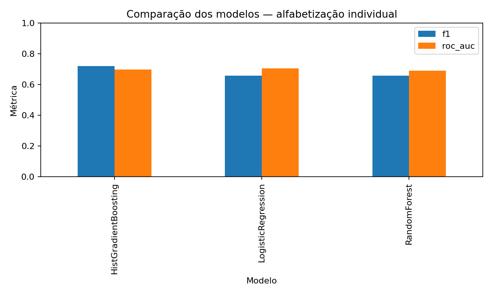
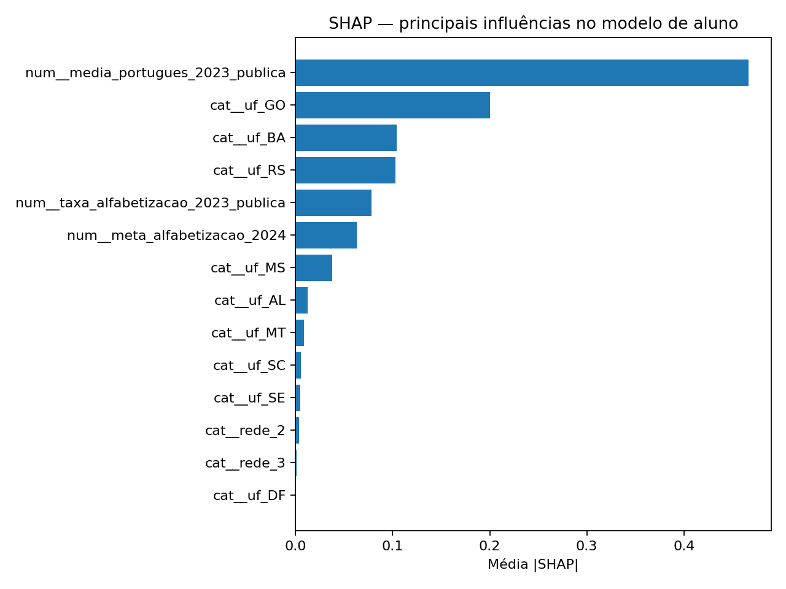
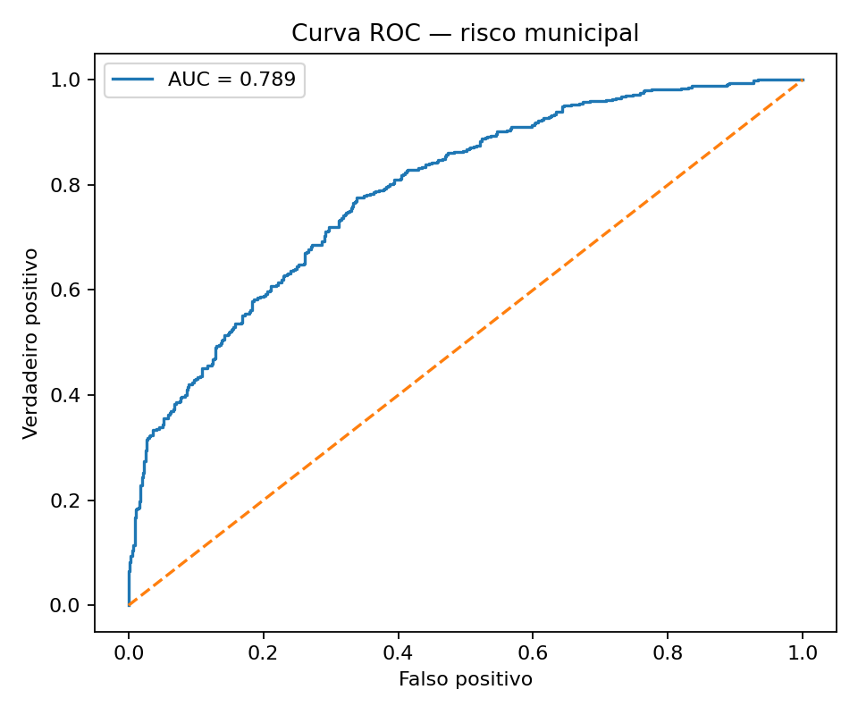
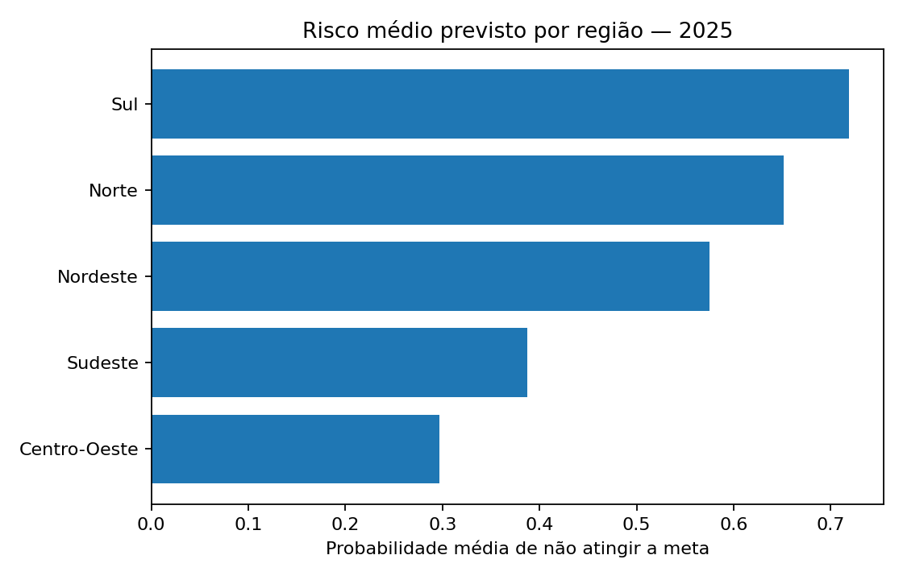
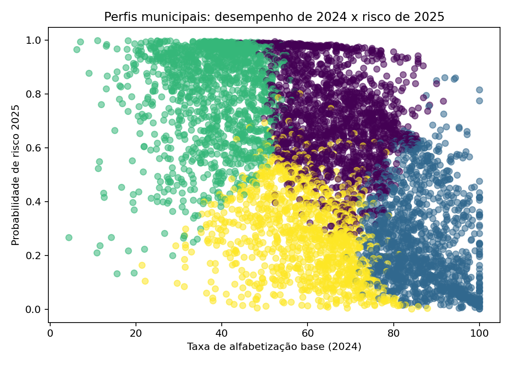

# Tech Challenge — Fase 3
## Predição e Inteligência Analítica para Alfabetização no Brasil

**Aluno:** Lucas Lourenço  
**RM:** 371753

Projeto de Ciência de Dados que dá continuidade à arquitetura Medallion construída na Fase 2 e utiliza as camadas Silver e Gold para modelagem supervisionada, interpretabilidade e priorização de risco educacional.

## Objetivos

- prever se um aluno avaliado será classificado como alfabetizado;
- identificar os fatores mais associados à predição;
- estimar quais municípios apresentam maior risco de ficar abaixo das metas;
- segmentar perfis municipais para apoiar priorização de políticas públicas;
- manter pré-processamento e modelo em pipelines reproduzíveis do Scikit-learn.

## Arquitetura analítica



## Decisão crítica: data leakage

`proficiencia` foi removida das features. Entre os alunos efetivamente avaliados, **100.0%** dos rótulos `alfabetizado` coincidem com a regra `proficiencia >= 743`. Usar essa coluna faria o modelo receber, na prática, a regra do próprio target.

Também não usamos `presenca` nem `preenchimento_caderno` como preditores. Eles apenas definem a população efetivamente avaliada.

## Modelo 1 — Alfabetização individual

População: alunos de 2024 presentes, com caderno preenchido e proficiência observada.  
Features: UF, rede, taxa pública municipal de alfabetização de 2023, média municipal de português de 2023 e meta municipal de 2024.

O split é feito por município para reduzir memorização territorial.

| Métrica | Resultado |
|---|---:|
| Accuracy | 0.650 |
| Precision | 0.663 |
| Recall | 0.781 |
| F1 | **0.717** |
| ROC-AUC | **0.697** |

Modelo final: **HistGradientBoosting** após GridSearchCV + GroupKFold.





## Modelo 2 — Risco municipal de não atingir meta

Treino: status de 2024.  
Features: taxa de alfabetização de 2023, média de português de 2023, meta de 2024 e UF. O gap é usado nos relatórios, mas não entra simultaneamente com taxa e meta no modelo para evitar redundância linear.

| Métrica | Resultado |
|---|---:|
| Accuracy | 0.708 |
| Precision | 0.688 |
| Recall | 0.685 |
| F1 | **0.686** |
| ROC-AUC | **0.789** |

Modelo final: **Regressão Logística** otimizada por validação cruzada.



### Aplicação para 2025

O modelo foi reaplicado usando taxa observada em 2024 e meta de 2025. A saída completa está em `reports/previsoes_risco_municipal_2025.csv`.

- Municípios analisados: **5,352**
- Classificados com risco >= 50%: **2,911**
- Maior risco médio regional: **Sul (71.9%)**



## Perfis municipais

Foi adicionada uma análise exploratória K-Means com 4 perfis municipais. Ela não substitui o modelo supervisionado; serve para identificar territórios com padrões parecidos de desempenho, meta e risco.



## Estrutura do repositório

```text
tech-challenge-fase-3/
├── data/
│   ├── raw/
│   ├── processed/
│   └── README.md
├── notebooks/
│   ├── 01_eda.ipynb
│   ├── 02_modelo_alfabetizacao.ipynb
│   ├── 03_risco_municipal.ipynb
│   └── 04_interpretabilidade.ipynb
├── src/
│   ├── preprocessing/
│   ├── modeling/
│   ├── evaluation/
│   └── visualization/
├── reports/
├── images/
├── models/
├── docs/
├── run_pipeline.py
├── requirements.txt
└── README.md
```

## Como executar

```bash
python -m venv .venv
```

No Windows:

```powershell
.venv\Scripts\Activate.ps1
pip install -r requirements.txt
python run_pipeline.py
```

Ou abra os notebooks na ordem numérica.

## Entregáveis

- EDA e diagnóstico de leakage;
- pipelines de pré-processamento integradas ao modelo;
- comparação e otimização de modelos;
- validação e métricas;
- matriz de confusão e ROC;
- interpretabilidade com permutação e SHAP;
- previsão municipal de risco para 2025;
- clusterização exploratória de perfis municipais;
- documentação técnica;
- roteiro do vídeo executivo de até 5 minutos.

## Limitações

1. O CSV Silver disponibilizado contém **62,767 linhas**, menor que o volume documentado na Fase 2. Por isso, o modelo individual representa a exportação recebida.
2. As tabelas enviadas não contêm variáveis socioeconômicas. A inclusão de IBGE/Censo Escolar/PNAD é a evolução mais importante.
3. O modelo municipal de 2025 extrapola o padrão observado na transição 2023→2024 e deve ser usado como priorização de risco, não como estimativa causal.
4. Os dados Gold exportados não incluem nomes dos municípios; os rankings usam código IBGE.

## Principais arquivos de resultado

- `reports/relatorio_tecnico.md`
- `reports/metricas_modelo_aluno_final.json`
- `reports/metricas_modelo_municipal_final.json`
- `reports/previsoes_risco_municipal_2025.csv`
- `reports/top_100_risco_municipal_2025.csv`
- `reports/clusters_municipais_2025.csv`
- `docs/roteiro_video_5min.md`

## Reprodutibilidade

O projeto foi estruturado para permitir a reprodução completa da pipeline de Machine Learning.

Para instalar as dependências:

```bash
pip install -r requirements.txt